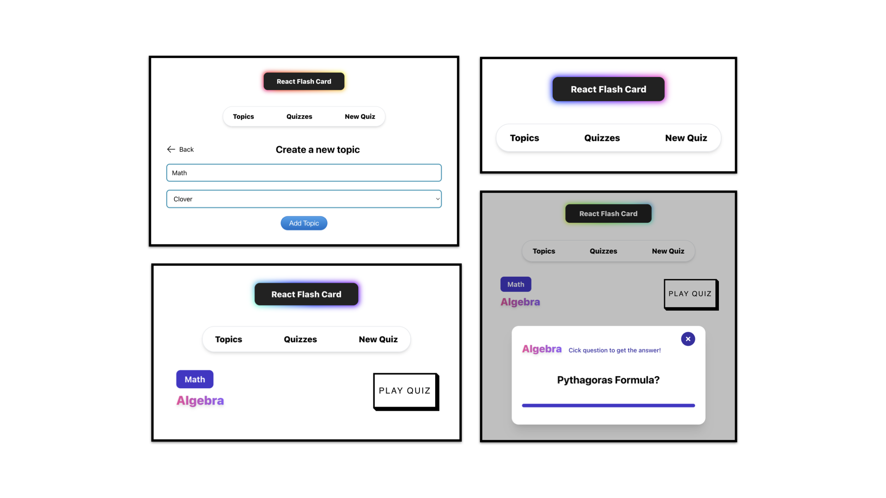

# Flash Card

Alright, another project is done. A little bit about the project:

This flash-card site could be used as a learning partner, especially if you are a student and struggle to memorize study material from particular subject.
The main feature is to create a quiz consists of cards (each comes with question and answer) which categorized by topics. To use the app, you guys could proceed to [the site](https://cute-snickerdoodle-d15ba1.netlify.app/). Thanks to netlify. 

**This site is not optimized for mobile usage instead, use browser for better experience. This site also used the help of mws & mws/data (mocking work service) to mock the data relationship and http request. If you refresh the browser, then all of the data will be erased.**

Follow guidelines below to use the site:

1. Create a topic
2. Create a new quiz
3. Choose one of created topics and add cards as many as you like. Then, create the quiz
4. Go to quizzes page and hit play button
5. Hint: click the question to get the answer 

Obviously, this project lacks a lot of features, because the main objective is to use my current knowledge about react from life-cycle hooks, router to state-management with redux. It's not perfect but I'm proud of it and I think it's a pretty cool project and there are still a lot of react subjects that I want to learn such as planning a project architecture, rendering optimization, component design pattern, etc. Tomorrow, I am planning to do another project, a pair-matching, kind of memorizing game. Let's see what new things I could learn. 

**NOTE**: For anyone who is currently learning front-end framework (not limited to react), you guys could start by building a simple project like this. Also check my other works in the repository for project inspiration. For you guys who is currently learning react, please do fork this project and try to add new features. I already tried to create the project app structure as neat as possible, so you guys might not have any difficulties to follow along. Here are some of my suggesstions for new features.

1. Optimizing the layout for mobile usage
2. Filter create quizzes with category
3. Add form validation to cards adding form
4. Add more cards to a selected quiz

etc.

This project was inspired by codecademy course project, but I only took the app looks, how they work as inspiration and coded mainly from scratch. I also used some css snippets from [css-scan](https://getcssscan.com/css-buttons-examples) to create stunning buttons.

### Project Screen Shots

### Dependencies

- @headlessui/react: `^1.7.4`
- @heroicons/react: `^2.0.13`
- @reduxjs/toolkit: `^1.9.0`
- formik: `^2.2.9`
- react-redux: `^8.0.5`
- react-router-dom: `^6.4.3`
- redux: `^4.2.0`
- styled-components: `^5.3.6`
- yup: `^0.32.11`
- @faker-js/faker: `^7.6.0`
- @mswjs/data: `^0.11.0`
- msw": `^0.48.0`
- tailwindcss": `^3.2.2`

### Available Scripts

In the project directory, you can run:

### `npm install`

To install all of the needed dependencies, then:

### `npm start`

Runs the app in the development mode.\
Open [http://localhost:3000](http://localhost:3000) to view it in your browser.

You may also see any logs in the console when performing any form submission event.

